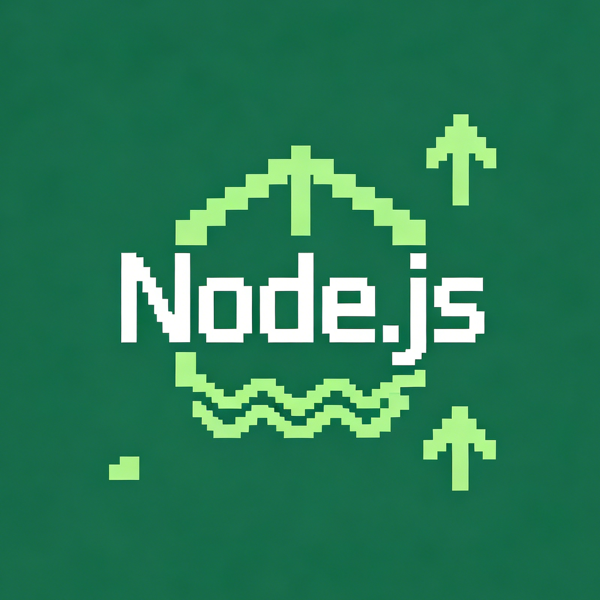
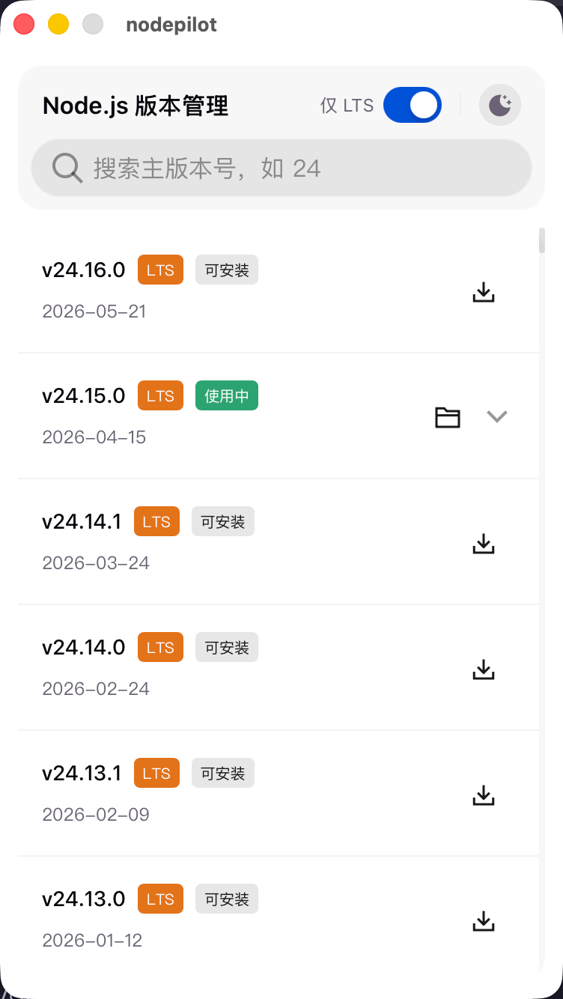
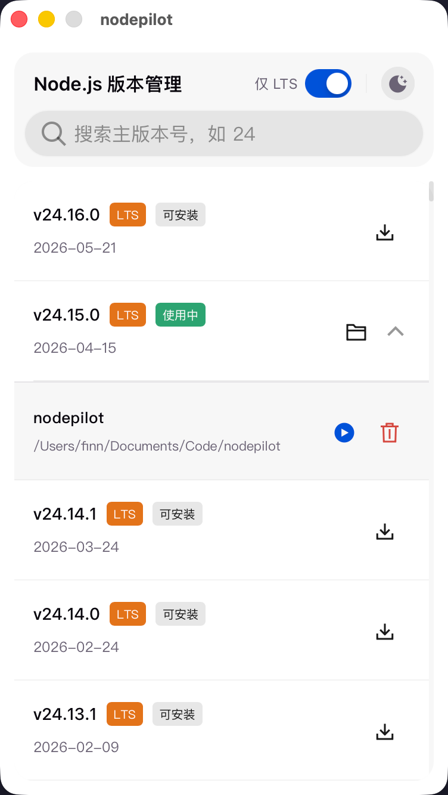

<div align="center">
  
  <h1>nodepilot</h1>
  <p><strong>Node.js 版本管理器 · 图形界面</strong></p>
  <p>
    
    
    
    
  </p>
</div>

---

**nodepilot** 是一款基于 Tauri 构建的桌面端 Node.js 版本管理工具。核心功能是**为每个项目单独绑定 Node.js 版本**——不同项目自动使用各自指定的 Node 版本，告别手动 `nvm use` 切换。除此之外，查看版本、安装、切换、删除，以及一键启动开发服务，一切皆可点击完成。常驻系统托盘，随时可用。

## ✨ 特性

- **🔧 零配置接管** — 首次启动自动将 `~/.nodepilot/current/bin` 注入系统 PATH，无需手动配置环境变量
- **🛡️ 竞品兼容** — 自动检测并禁用 nvm/fnm/volta 等已有版本管理器的 Shell Hook，确保 nodepilot 优先级最高
- **↩️ 环境回滚** — 自动配置失败时完整回滚所有修改（LaunchAgent、注册表、Shell 配置），提供重试/跳过选项
- **🖥️ 系统托盘常驻** — 后台静默运行，托盘图标实时显示当前激活的 Node.js 主版本号
- **🔍 搜索过滤** — 按主版本号快速筛选，支持仅显示 LTS 版本
- **⬇️ 一键安装** — 点击安装按钮，自动下载、解压、放置到 `~/.nodepilot/versions/`
- **🔄 一键切换** — 点击激活按钮，自动更新 `~/.nodepilot/current` 符号链接
- **📦 全局包迁移** — 切换版本时自动重装 npm 全局包，无缝衔接
- **🗑️ 一键删除** — 删除已安装版本释放磁盘空间，带确认保护
- **📂 项目绑定** — 将 Node 版本与项目目录关联，支持自定义别名、默认脚本和命令前缀
- **▶️ 开发服务管理** — 一键启动/停止 dev server，自动检测包管理器（pnpm / yarn / npm）
- **📋 实时日志** — 独立窗口实时展示 dev server 输出，macOS 上通过 PTY 消除子进程缓冲延迟
- **🔄 自动启动** — 支持开机自启，始终可用
- **🔄 自动更新** — 支持应用内自动检查并安装新版本
- **🛠️ 自定义镜像** — 支持配置自定义 Node.js 下载镜像源
- **🌐 离线可用** — 缓存版本列表，离线时仍可查看和切换已安装版本

## 🖼️ 截图

**版本管理面板** — 查看可用版本、安装/切换/删除操作、搜索过滤与 LTS 筛选

<div align="center">
  
</div>

**项目管理** — 折叠面板内展示绑定的项目，支持一键启动/停止开发服务、查看日志、编辑别名与移除绑定

<div align="center">
  
</div>

## 🚀 快速开始

### 安装

从 [Releases 页面](https://github.com/Theworld7/Nodepilot/releases) 下载最新版 DMG 或 ZIP 安装包。

### 首次使用

首次启动时，nodepilot 会自动接管系统 Node.js 环境：

1. 启动应用，弹出环境配置确认对话框
2. 点击「重试」，应用自动将 `~/.nodepilot/current/bin` 注入系统 PATH
   - macOS：创建 LaunchAgent + 修改 `.zshrc`/`.bashrc`
   - Windows：修改 HKCU 注册表 PATH
3. 自动检测并禁用已有版本管理器的 Shell Hook（nvm、fnm、volta 等），确保 nodepilot 优先级最高
4. 配置失败时自动回滚所有修改，可重试或跳过
5. 打开新终端，`node` 命令即指向 nodepilot 管理的版本

## 🎯 使用场景

| 场景 | 操作 |
|------|------|
| 查看当前 Node.js 版本 | 瞥一眼托盘图标即可 |
| 安装最新 LTS 版本 | 打开面板 → 点击「安装」|
| 项目需要 Node 18 | 搜索 "18" → 筛选 → 点击「激活」|
| 清理旧版本 | 点击「删除」→ 确认 |
| 切换版本时迁移全局包 | 激活后选择「重装全局 npm 包」|
| 为项目绑定 Node 版本 | 点击文件夹图标 → 选择项目目录 |
| 修改项目别名/默认脚本 | 展开版本 → 编辑项目配置 |
| 启动项目开发服务 | 展开版本 → 点击项目旁的 ▶️ |
| 查看服务运行日志 | 服务运行中点击日志按钮 |
| 首次启动自动配置 | 确认对话框 → 自动注入 PATH → 重启终端即可 |

## 🏗️ 技术栈

| 层 | 技术 |
|----|------|
| 桌面框架 | [Tauri 2](https://v2.tauri.app/) |
| 后端语言 | Rust 2021 edition |
| 前端框架 | [Vue 3](https://vuejs.org/) + TypeScript |
| UI 组件库 | [tdesign-vue-next](https://tdesign.tencent.com/vue-next/) |
| 构建工具 | [Vite](https://vitejs.dev/) |
| 包管理器 | pnpm |

## 🧱 项目结构

```
nodepilot/
├── src/                          # Vue 3 前端
│   ├── App.vue                   # 根组件（路由 + 环境配置对话框）
│   ├── main.ts
│   ├── panels/
│   │   ├── VersionListPanel.vue      # 版本列表面板
│   │   └── LogView.vue               # Dev Server 日志独立窗口
│   ├── components/
│   │   ├── VersionRow.vue            # 版本条目（含折叠面板）
│   │   ├── ProjectRow.vue            # 项目条目（含启动/停止/日志/别名）
│   │   └── CodeBlock.vue             # 代码块组件
│   ├── composables/
│   │   ├── useVersionManager.ts      # IPC 封装组合函数
│   │   └── useTheme.ts               # 明暗主题切换
│   ├── types/
│   │   └── index.ts                  # TypeScript 类型定义
│   ├── assets/
│   └── style.css
├── src-tauri/                    # Rust 后端
│   ├── capabilities/
│   │   └── default.json              # 权限配置（main, log-* 窗口）
│   └── src/
│       ├── main.rs                   # 入口
│       ├── lib.rs                    # Tauri 应用启动 + 插件注册（自动启动/更新/对话框）
│       ├── commands.rs               # IPC 命令（版本/项目/日志/环境配置）
│       ├── env_setup.rs              # 自动环境配置（PATH 注入、竞品检测、失败回滚）
│       ├── client.rs                 # HTTP 客户端（含 test mock）
│       ├── fs.rs                     # 文件系统抽象（含 test mock）
│       ├── error.rs                  # 统一错误类型 AppError
│       ├── tray.rs                   # 托盘图标生成
│       ├── project/                  # 项目管理模块（预留）
│       ├── updater/                  # 自动更新模块（预留）
│       └── version/
│           ├── mod.rs
│           ├── types.rs              # 数据结构
│           ├── error.rs              # 领域错误
│           ├── event.rs              # 事件系统
│           ├── manager.rs            # 统一入口 VersionManager
│           ├── fetcher.rs            # 远程版本列表获取与缓存
│           ├── installer.rs          # 下载与安装（流式进度回调）
│           ├── activator.rs          # 符号链接切换
│           ├── deleter.rs            # 删除版本
│           └── tests.rs              # 单元测试
├── screenshots/                  # 截图
│   ├── version-list.png
│   └── project-management-overview.png
├── docs/
│   ├── prd.md
│   └── adr/
│       ├── 0001-rust-owns-version-management.md
│       ├── 0002-popup-window-panel.md
│       ├── 0003-dynamic-tray-icon.md
│       └── 0004-regular-desktop-window.md
└── package.json
```

## 🛠️ 本地开发

### 前置要求

- [Rust](https://www.rust-lang.org/)（推荐使用 rustup 安装）
- [Node.js](https://nodejs.org/) ≥ 18
- [pnpm](https://pnpm.io/)

### 启动开发环境

```bash
# 安装前端依赖
pnpm install

# 启动 Tauri 开发模式（自动启动 Vite + 桌面应用）
pnpm tauri dev
```

### 构建

```bash
pnpm tauri build
```

构建产物位于 `src-tauri/target/release/bundle/`。

## 🗺️ 数据目录

```
~/.nodepilot/
├── current -> versions/v24.1.2/    符号链接，指向当前激活的版本
├── .auto-setup-done                环境配置完成标志
├── .auto-setup-error               环境配置失败信息（用于重试提示）
├── versions/
│   ├── v18.20.0/
│   │   └── bin/node
│   └── v24.1.2/
│       └── bin/node
├── cache/
│   └── versions.json               远程版本列表缓存
├── config.json                     用户配置（镜像源等）
└── projects.json                   项目绑定列表（含别名、默认脚本、命令前缀）
```

## 📄 架构决策

关键架构决策记录在 `docs/adr/` 中：

- [ADR-0001](docs/adr/0001-rust-owns-version-management.md) — Rust 后端自主管理所有版本逻辑
- [ADR-0002](docs/adr/0002-popup-window-panel.md) — 弹出式面板（已被 ADR-0004 替代）
- [ADR-0003](docs/adr/0003-dynamic-tray-icon.md) — 动态托盘图标显示版本号
- [ADR-0004](docs/adr/0004-regular-desktop-window.md) — 传统桌面窗口替代弹出面板

## 🤝 贡献

欢迎提交 Issue 和 Pull Request！

## 📄 许可证

[MIT](./LICENSE)
